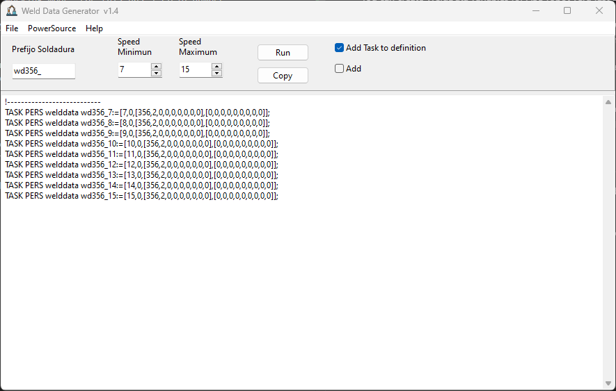

# WeldDataGenerator
This software is a tool to generate code with welddata variables to ABB robots

## Introduccion

You can create WeldData variables for ABB robot veru fast and easy. 

The weldata variables, in ABB robots, stores information to weld with MIG/MAG source, speed for welding, program or job to send to power source, and working mode. For this has 3 field number

For Fronius power source and most power sources, only need the job number, so ABB robot stores the weldingspeed, job and mode, which is always 2. 

For SKSWelding, in standard mode you have the program number, group number an part number. So ABB robot stores the speed welding, the program number, and the mode fild are a masked number of group number and part number

## Using

Usually the customers wants the welddata variables defined with diferents speed. 
With this software you can genere all variables for the same weld job with differents speeds.

You give a name, the minimun speed and the maximun speed, and you get all welddata variables, ready to export to your programa.

